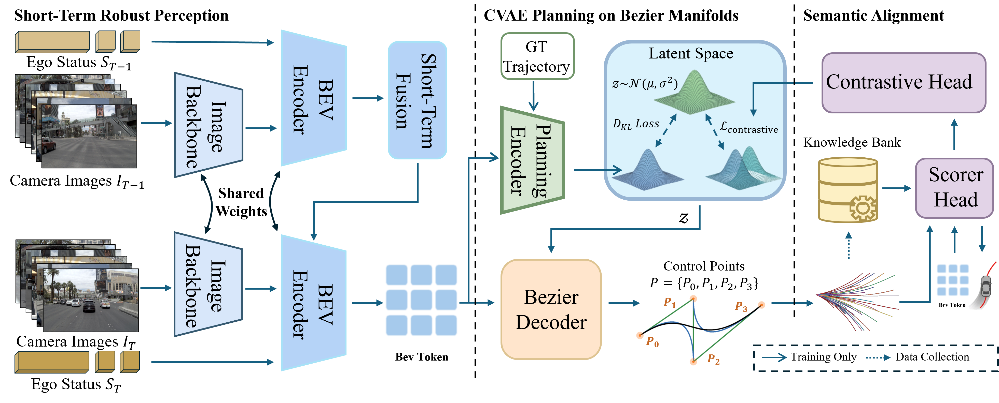
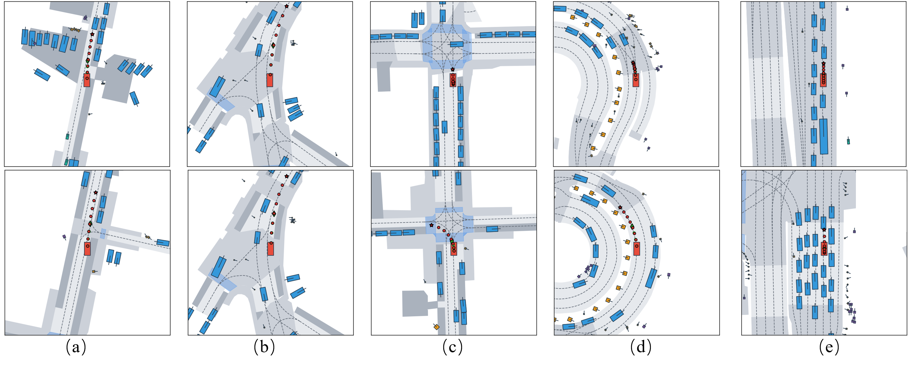
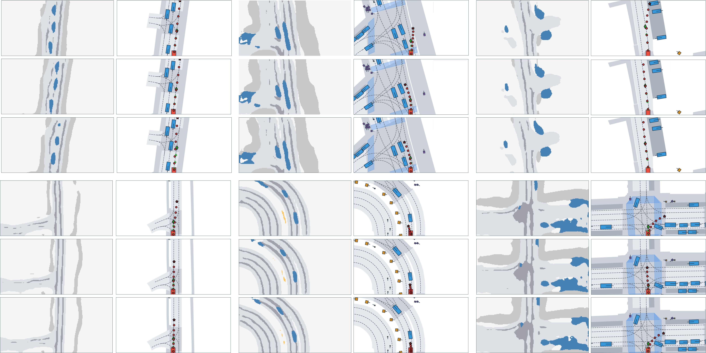
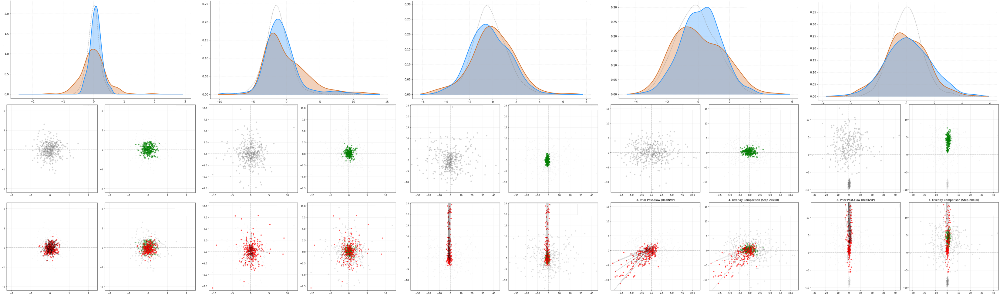

# RoBeG: A Knowledge-Driven and Geometrically Constrained Generative Framework for Robust End-to-End Autonomous Driving

  

 &nbsp;
 &nbsp;
 &nbsp;  

**Rui Zhao**$^{1}$, **Ziguo Chen**$^{1}$, **Yuze Fan**$^{1}$...

$^{1}$[College of Automotive Engineering, Jilin University], $^{2}$[National Key Laboratory of Automotive Chassis Integration and Bionics, Jilin University], ...

## 📢 Abstract
While end-to-end autonomous driving holds compelling promise, its robustness is often compromised by temporal feature drift and geometric discontinuity. We present **RoBeG**, a robust perception and generative planning framework. 

1.  **Anti-Drift Perception**: A **Short-Term Error Truncation (STET)** mechanism acts as a temporal firewall against cumulative localization noise.
2.  **Bezier Planning**: A probabilistic head on **Bezier Manifolds** guarantees kinematic feasibility and smoothness.
3.  **Semantic Alignment**: A **Flow-Enhanced Prior** aligned with expert knowledge via contrastive learning ensures generalization.

Extensive experiments on **NavSim** demonstrate that RoBeG achieves state-of-the-art performance (**86.8 EPDMS**), significantly outperforming existing methods in planning accuracy and robustness against severe localization noise.

---
## ✨ Qualitative Visualization

### 1. Generalization across Diverse Scenarios
RoBeG demonstrates robust planning capabilities across a wide spectrum of driving conditions. As shown below, our **Parametric Bezier Planning Head** ensures trajectory smoothness and kinematic feasibility in challenging environments:

- **(a) Urban Navigation**: Navigating narrow urban streets with static obstacles.
- **(b) Lane Interaction**: Smooth merging and branching at Y-junctions.
- **(c) Complex Intersections**: Handling unprotected left turns and multi-agent interactions.
- **(d) High-Curvature Roads**: Precise path tracking on roundabouts and curved roads (High **Lane Keeping** score).
- **(e) Dense Traffic**: Safe car-following and stop-and-go maneuvers in congestion.

### 2. Robustness against Sensor Failure (Anti-Drift)
We stress-test RoBeG by injecting severe localization noise ($\sigma_{pos}=1.0m, \sigma_{rot}=1.0^\circ$) during inference.
Thanks to the **Short-Term Error Truncation (STET)** mechanism, RoBeG acts as a "temporal firewall," preventing localization errors from cascading into feature drift.

> **Observation**: Even under 1.0m positional shift (Bottom Row), RoBeG's planned trajectory (Red) remains consistent with the Clean baseline (Middle Row) and safe, whereas traditional long-term fusion methods typically suffer from severe jitter or off-road planning.

### 3. Interpretable Latent Space Evolution
How does RoBeG solve mode collapse? We visualize the latent space evolution during training. The **Flow-Enhanced Prior** (Blue/Red) progressively deforms to match the complex, multi-modal expert posterior (Orange/Green), driven by our **Knowledge-Driven Semantic Alignment**.

---

## 🏆 State-of-the-Art Performance

We conduct a comprehensive evaluation on the **NavSim** benchmark. RoBeG achieves new SOTA results on both v1 and v2 metrics.

### 1. Main Leaderboard (EPDMS v2)
RoBeG outperforms both camera-only and LiDAR-enabled baselines. Notably, it achieves the highest **Lane Keeping (LK)** and **Traffic Light Compliance (TLC)** scores.

| Method | Modality | **EPDMS** $\uparrow$ | NC (Safety) | DAC (Area) | LK (Lane) | EP (Progress) |
| :--- | :---: | :---: | :---: | :---: | :---: | :---: |
| TransFuser | C + L | 76.7 | 96.9 | 89.9 | 92.7 | 87.1 |
| HydraMDP++ | C + L | 81.4 | 97.2 | **97.5** | 94.4 | 83.1 |
| DriveSuprem | C | 83.1 | 97.5 | 96.5 | 95.5 | **88.4** |
| DiffusionDrive | C | 84.5 | **98.2** | 95.9 | 96.8 | 87.5 |
| **RoBeG (Ours)** | **C** | **86.8** | 97.6 | 95.1 | **97.6** | 88.0 |

### 2. Performance Trajectory & Efficiency
RoBeG offers a flexible trade-off between performance and computational cost.
- **RoBeG-Base**: SOTA performance for safety-critical applications.
- **RoBeG-Tiny**: High efficiency for edge deployment, still outperforming TransFuser.

| Model Variant | Resolution | Encoder Layers | EPDMS | vs. Baseline |
| :--- | :---: | :---: | :---: | :--- |
| **RoBeG-Tiny** | $480 \times 270$ | 2 | **80.2** | :chart_with_upwards_trend: > TransFuser |
| **RoBeG-Base** | $960 \times 540$ | 4 | **86.8** | :trophy: **SOTA** |

> **Insight**: The significant gain of RoBeG-Tiny (+8.5 points over geometric baseline) verifies that our *Semantic Alignment* strategy effectively compensates for limited sensor resolution.

---

## 🛠️ Roadmap

- [ ] Release inference code and model definition.
- [ ] Release pretrained weights (RoBeG-Base & RoBeG-Tiny).
- [ ] Release training scripts and configuration files.
- [ ] Provide a tutorial for running on custom data.
